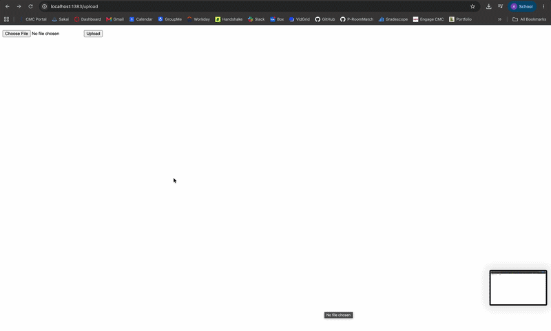

# Flask on Docker

## Overview

This repository is a containerized Flask web application backed by a PostgreSQL database, built from the TestDriven.io "Dockerizing Flask with Postgres, Gunicorn, and Nginx" tutorial and updated to work with current versions of its dependencies. In development, the app runs on Flask's built-in server with live code reloading. In production, it runs under the Gunicorn WSGI server behind an Nginx reverse proxy, which serves static files and user-uploaded media directly. Docker Compose orchestrates the services, and a GitHub Actions workflow verifies on every push that the development stack builds and responds to requests. Users can upload an image at `/upload` and view it at `/media/<filename>`.

## Tech Stack

- **Flask** web framework, with **Flask-SQLAlchemy**
- **PostgreSQL 13** database
- **Gunicorn** application server (production)
- **Nginx** reverse proxy and static/media file server (production)
- **Docker** and **Docker Compose**
- **GitHub Actions** for continuous integration

## Build Instructions

You need Docker with the Compose plugin installed.

### Development

    git clone https://github.com/amargkumar/flask-on-docker.git
    cd flask-on-docker
    docker compose up -d --build

The app is available at http://localhost:5083.

- `/` returns `{"hello": "world"}`
- `/upload` lets you upload an image
- `/media/<filename>` displays an uploaded image
- `/static/hello.txt` serves a static file

Stop it with `docker compose down -v`.

### Production

1. Create `.env.prod` and `.env.prod.db` in the project root. These are kept out of version control. Use the same password in both.

   `.env.prod`:

       FLASK_APP=project/__init__.py
       FLASK_DEBUG=0
       DATABASE_URL=postgresql://hello_flask:<password>@db:5432/hello_flask_prod
       SQL_HOST=db
       SQL_PORT=5432
       DATABASE=postgres
       APP_FOLDER=/home/app/web

   `.env.prod.db`:

       POSTGRES_USER=hello_flask
       POSTGRES_PASSWORD=<password>
       POSTGRES_DB=hello_flask_prod

2. Build and start the services, then create the database tables:

       docker compose -f docker-compose.prod.yml up -d --build
       docker compose -f docker-compose.prod.yml exec web python manage.py create_db

3. Visit http://localhost:1383. Upload an image at `/upload` and view it at `/media/<filename>`.

Stop it with `docker compose -f docker-compose.prod.yml down -v`.

## Changes from the Original Tutorial

- Switched the base image from `python:3.11.3-slim-buster` to `python:3.11-slim-bookworm`, because Debian Buster has reached end of life and its package repositories no longer work.
- Installed `netcat-openbsd` in place of `netcat`, which is only a virtual package on Bookworm.
- Added a Postgres healthcheck so the web container waits until the database is actually ready.
- Raised Nginx's `client_max_body_size` to 20 MB so image uploads larger than 1 MB succeed.
- Pinned Werkzeug and SQLAlchemy versions to stay compatible with Flask 2.3.
- Moved ports to 5083 (dev) and 1383 (prod) to avoid conflicts on a shared server.
- Production credentials are excluded from version control with `.gitignore`.
